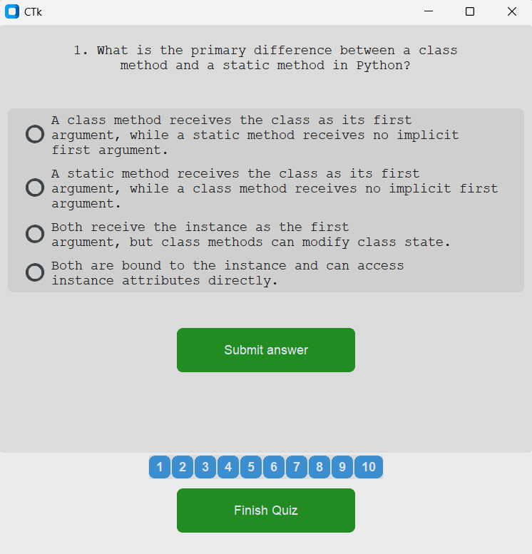

# The AI Quiz App

An interactive quiz application powered by AI.  
Users can select a topic, generate AI-powered questions, and test their knowledge in a fun and engaging way.

---

## 🚀 Features

- AI-generated quiz questions from multiple topics
- Simple, clean UI with navigation between questions
- Ability to add your own topics
- Environment variable support for keeping your API key safe

---

## 🛠️ Setup & Installation

### 1. Clone the repository

```bash
git clone https://github.com/petkov93/TheAIQuizApp.git
cd TheAIQuizApp
```

### 2. Create a virtual environment (optional, but recommended)

```bash
python -m venv venv
source venv/bin/activate    # Linux/Mac
venv\Scripts\activate       # Windows
```

### 3. Install dependencies

```bash
pip install -r requirements.txt
```

### 4. Configure environment variables

Create a `.env` file in the root directory and add your **GROQ API key**:

```env
GROQ_API_KEY=your_api_key_here
```

> ⚠️ Make sure `.env` is in your `.gitignore` so it is not pushed to GitHub.

---

## ▶️ Usage

Run the app from the root directory:

```bash
python main.py
```

1. Select a topic from the grid of buttons
2. The app fetches quiz questions from the AI
3. Answer questions one by one or use the navigation buttons to jump between them

---

## ➕ Adding New Topics

All topics are defined in the **`const`** file.  
To add a new topic:

1. Open `const.py` (or the relevant constants file)
2. Add your new topic to the topics list

Example:

```python
TOPICS = [
    "Python",
    "Machine Learning",
    "Cybersecurity",
    "New Topic Here"  # 👈 Add your custom topic
]
```

---

## 🖼️ Sample Screenshots

Here’s what the app looks like:

  
  
  
  


---

## 📜 License

This project is licensed under the [MIT License](LICENSE).

---

## 🙌 Contributing

Pull requests are welcome!  
If you’d like to suggest improvements or new features, feel free to open an issue.
